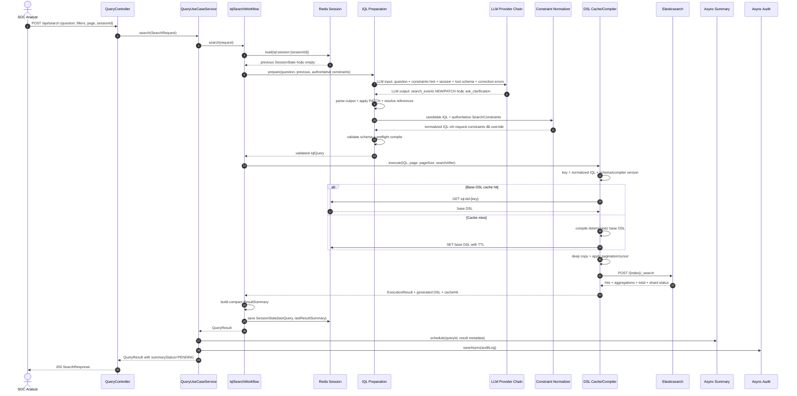

# AI SOC Event Search Demo

A short demonstration of a Spring Boot backend that turns natural-language SOC questions into validated IQL, executes Elasticsearch queries, stores session/cache state in Redis, and records query history in PostgreSQL.

## Prerequisites

- Java 21
- Docker Desktop or Docker Engine with Docker Compose
- PowerShell on Windows, or a compatible shell on Linux/macOS
- Optional: Maven 3.9+ if you do not use the included Maven wrapper
- Optional: Python 3.10+ for benchmark and evaluation scripts
- Optional: at least one LLM API key when running with real providers:
  - `GEMINI_API_KEY` or `GOOGLE_API_KEY`
  - `OPENROUTER_API_KEY`

## Installation

From the `demo` folder:

```powershell
cd D:\VDT_SE_WEB_2026_Main\demo
.\mvnw.cmd clean test
```

Start the supporting services and application with Docker Compose:

```powershell
docker compose up --build -d
docker compose ps
```

The Compose stack starts:

- Spring Boot API on `http://localhost:8080`
- Elasticsearch on `http://localhost:9200`
- PostgreSQL on localhost port `5433`
- Redis on localhost port `6379`
- Fluentd receiver on port `24224`

Swagger UI is available at:

```text
http://localhost:8080/swagger-ui.html
```

## Run With Profile

Docker Compose runs the application with the `dev` profile:

```yaml
SPRING_PROFILES_ACTIVE=dev
```

To run dependencies in Docker but run Spring Boot locally:

```powershell
docker compose up -d elasticsearch postgres redis fluentd

$env:SPRING_PROFILES_ACTIVE = "dev"
$env:POSTGRES_URL = "jdbc:postgresql://localhost:5433/demo_db"
$env:POSTGRES_USER = "postgres"
$env:POSTGRES_PASSWORD = "password"
$env:ELASTICSEARCH_URIS = "http://localhost:9200"
$env:SPRING_DATA_REDIS_HOST = "localhost"
$env:SPRING_DATA_REDIS_PORT = "6379"

.\mvnw.cmd spring-boot:run
```

For deterministic local testing without external LLM calls, set mock mode before starting the app:

```powershell
$env:APP_LLM_MODE = "mock"
.\mvnw.cmd spring-boot:run
```

For real LLM providers, keep `APP_LLM_MODE=real` or omit it, then set at least one API key:

```powershell
$env:APP_LLM_MODE = "real"
$env:OPENAI_API_KEY = "<your-key>"
```

## System Testing

Run unit and integration tests:

```powershell
.\mvnw.cmd test
```

Check the API after the stack is running:

```powershell
curl.exe http://localhost:9200/_cluster/health
```

Run a search request:

```powershell
Invoke-RestMethod `
  -Method Post `
  -Uri "http://localhost:8080/api/search" `
  -ContentType "application/json" `
  -Body '{
    "question": "Top 10 IPs with critical alerts in June 2026",
    "severity": "critical",
    "page": 0,
    "pageSize": 20,
    "sessionId": "demo-session"
  }'
```

Import an event file:

```powershell
curl.exe -X POST "http://localhost:8080/api/events/import-file" `
  -F "file=@dataset/advanced_siem_dataset.jsonl"
```

Run evaluator tests:

```powershell
python -m unittest discover -s evaluation -p "test_*.py"
```

Run the V3 benchmark against a running backend:

```powershell
.\evaluation\run_v3_benchmark.ps1
```

## Project Structure

```text
demo/
|-- compose.yaml                  # Docker Compose stack
|-- Dockerfile                    # Spring Boot container build
|-- pom.xml                       # Maven build and dependencies
|-- src/
|   |-- main/
|   |   |-- java/vdt/se/demo/
|   |   |   |-- adapter/          # REST, persistence, Elasticsearch, Redis, LLM adapters
|   |   |   |-- application/      # Use cases, services, DTOs, ports
|   |   |   |-- domain/           # Domain models, IQL, exceptions, value objects
|   |   |   |-- DemoApplication.java
|   |   |-- resources/
|   |       |-- application-example.yml
|   |       |-- schema.sql
|   |       |-- schema-h2.sql
|   |       |-- llm/
|   |-- test/                     # Java tests
|-- fluentd/                      # Fluentd receiver config and Dockerfile
|-- data/                         # Local ingest data and runtime files
|-- dataset/                      # Demo/test datasets
|-- evaluation/                   # Benchmark cases, runner, metrics, reports
|-- scripts/                      # Maintenance scripts
|-- docs/                         # Architecture and project notes
|-- READ_ME.md                    # Extended project report
|-- README.md                     # Short setup and demo guide
```

## AI search end-2-end flowchart




## Key Features

- Natural-language SOC search through `POST /api/search`
- Intermediate Query Language validation before Elasticsearch execution
- Support for filters, time ranges, aggregation, sorting, pagination, and follow-up queries
- LLM provider chain for Gemini and OpenRouter
- Mock LLM mode for repeatable local testing
- Redis-backed session state and base DSL cache
- PostgreSQL-backed audit and query history
- Elasticsearch index initialization and query execution
- File ingest API through `POST /api/events/import-file`
- Fluentd-based ingest path for file and stream collection
- CSV export through `GET /api/search/{queryId}/export.csv`
- Async summary retrieval through `GET /api/search/{queryId}/summary`

## Troubleshooting

Check container status:

```powershell
docker compose ps
```

Read application logs:

```powershell
docker compose logs -f spring-boot-app
```

Read Fluentd logs:

```powershell
docker compose logs -f fluentd
```

If the app cannot connect to PostgreSQL, Elasticsearch, or Redis, verify these environment variables:

```text
POSTGRES_URL
POSTGRES_USER
POSTGRES_PASSWORD
ELASTICSEARCH_URIS
SPRING_DATA_REDIS_HOST
SPRING_DATA_REDIS_PORT
```

If search fails because no LLM provider is configured, either set a provider API key or run with:

```powershell
$env:APP_LLM_MODE = "mock"
```

If Elasticsearch data or mappings are stale during local development, stop the stack and recreate volumes:

```powershell
docker compose down -v
docker compose up --build -d
```

If Maven tests fail after dependency changes, rebuild from a clean target directory:

```powershell
.\mvnw.cmd clean test
```
