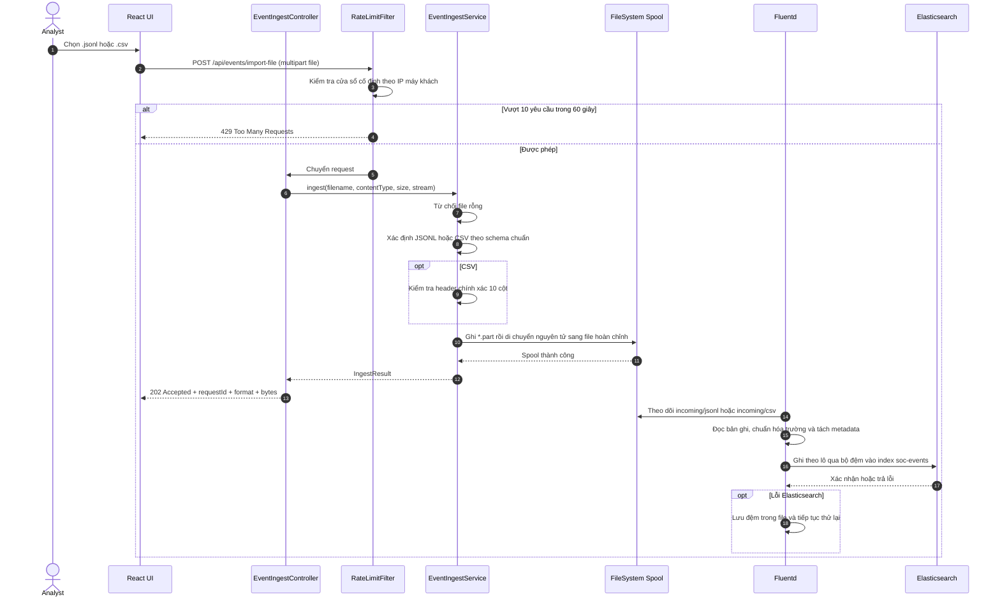
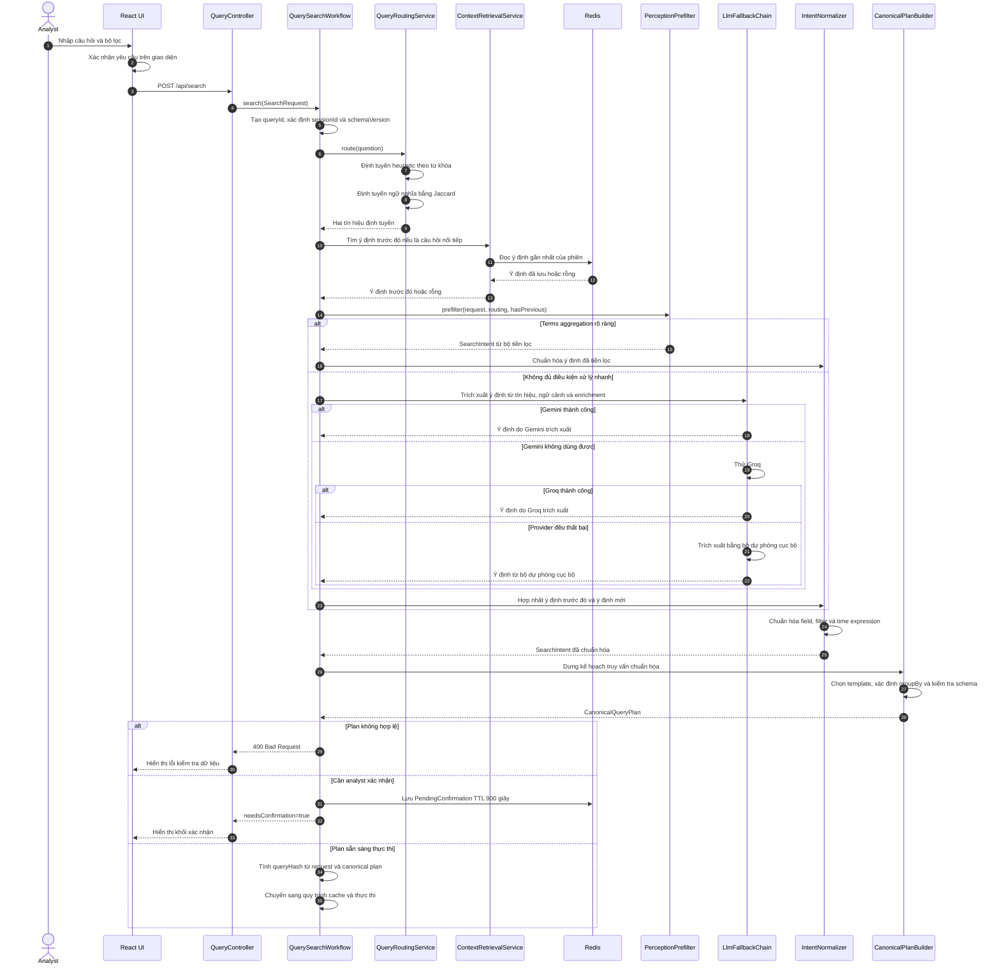
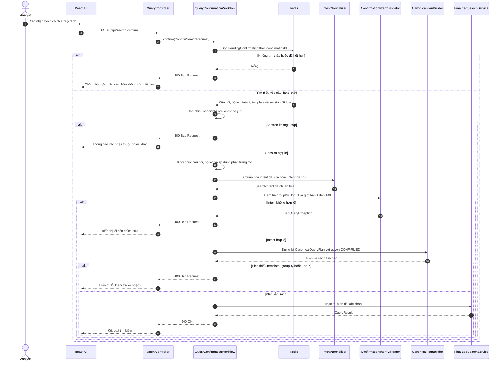
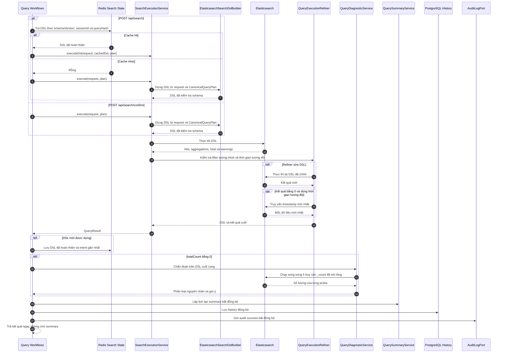

# BÁO CÁO MINI-PROJECT

## Xây dựng tính năng tìm kiếm Event bằng AI cho SOC Platform

| Thông tin | Nội dung |
|---|---|
| Học viên | Triệu Cao Tấn |
| Email | tantrieucao@gmail.com |
| Chương trình | Viettel Digital Talent 2026 |
| Lĩnh vực | Software Engineer |
| Mentor | LongNV17 và ThànhVĐT |
| Đơn vị | VCS |
| Phạm vi kiểm chứng | Toàn bộ mã nguồn trong repository tại ngày 29/06/2026 |

> Báo cáo này được đối chiếu trực tiếp với mã nguồn, cấu hình, test và các báo cáo benchmark đang có trong repository. Những nội dung chưa được triển khai hoặc chưa được kiểm chứng được ghi rõ ở phần giới hạn; không coi tên class, ý tưởng thiết kế hoặc kết quả confirmation là bằng chứng truy vấn Elasticsearch đã thực thi.

## Lời mở đầu

Trong vận hành SOC, analyst phải kết hợp hiểu biết về sự cố với kiến thức schema và cú pháp truy vấn. Mini-project này khảo sát một cách tiếp cận thực dụng: dùng AI để chuyển ngôn ngữ tự nhiên thành intent có cấu trúc, nhưng giữ validation và quyền tạo truy vấn thực thi trong application layer. Báo cáo trình bày đúng hiện trạng triển khai, kết quả đo đã lưu và các vấn đề kỹ thuật còn tồn tại để hệ thống có thể được đánh giá và tiếp tục phát triển trên cùng một cơ sở bằng chứng.

## Tóm tắt

Mini-project xây dựng một ứng dụng tìm kiếm security event bằng câu hỏi tự nhiên tiếng Việt, tiếng Anh hoặc ngôn ngữ trộn. Hệ thống không cho LLM sinh DSL rồi thực thi trực tiếp. LLM chỉ trích xuất một `SearchIntent` có cấu trúc; application layer tiếp tục hợp nhất ngữ cảnh, chuẩn hóa field/value/thời gian, chọn một trong ba template được kiểm soát và dùng code xác định để dựng Elasticsearch DSL.

Luồng chính đã có đủ các thành phần: giao diện React; REST API Spring Boot; heuristic và semantic routing cục bộ; Gemini/Groq kèm local fallback; canonical query plan; human-in-the-loop confirmation; Redis cache; Elasticsearch execution; zero-result diagnostic; summary bất đồng bộ; PostgreSQL history/audit; ingest JSONL/CSV qua filesystem spool và Fluentd. Docker Compose đóng gói Elasticsearch, PostgreSQL, Redis, backend và Fluentd; frontend hiện chạy riêng bằng Vite.

Kết quả kiểm chứng tại máy hiện tại được ghi ở mục 8.1. Các báo cáo benchmark ngày 26–27/06/2026 là artifact lịch sử tạo trước đợt sửa workflow ngày 28/06/2026; chúng vẫn hữu ích làm baseline. Mục 8.7 đối chiếu hai dataset `llm_cases.jsonl` và `workflow_comparison_cases.jsonl`; mục 8.8 so sánh trực tiếp `llm_baseline_benchmark.md` với `v2_report.md`, đồng thời tách rõ correctness của final execution với response confirmation an toàn.

## Mục lục

1. Bối cảnh, mục tiêu và phạm vi
2. Kiến trúc và công nghệ
3. Mô hình dữ liệu
4. Hợp đồng REST API
5. Quy trình chi tiết
6. Giao diện người dùng
7. Triển khai và cấu hình
8. Kiểm thử và đánh giá
9. Giới hạn và rủi ro đã xác định
10. Kết luận và hướng phát triển
11. Tài liệu đối chiếu trong repository

## Danh mục sơ đồ Mermaid

| Sơ đồ | Nội dung | Vị trí |
|---:|---|---|
| 1 | Tiếp nhận JSONL/CSV từ giao diện đến Elasticsearch | Mục 5.1 |
| 2 | Chuẩn bị truy vấn, định tuyến, trích xuất ý định và quyết định xác nhận | Mục 5.2 |
| 3 | Xác nhận và kiểm tra lại ý định | Mục 5.3 |
| 4 | Tra cứu cache, tạo DSL, thực thi, chẩn đoán và lưu vết | Mục 5.4 |

## Danh mục nhóm bảng

| Nhóm | Nội dung chính |
|---|---|
| Kiến trúc | Thành phần triển khai, package/layer và công nghệ |
| Dữ liệu | Elasticsearch fields, PostgreSQL tables và Redis keys |
| API | Endpoint, input, output và HTTP status |
| Quy trình | Giai đoạn, điều kiện chuyển nhánh, template, DSL và truy vấn chẩn đoán |
| Triển khai | Service/port, profile và cấu hình mặc định |
| Đánh giá | Test, coverage, dataset và benchmark |
| Rủi ro | Bảo mật, hợp đồng dữ liệu, quy trình và vận hành |

# 1. Bối cảnh, mục tiêu và phạm vi

## 1.1. Bối cảnh

Dữ liệu SOC đến từ nhiều nguồn và thường cần lọc theo thời gian, severity, event type, user, host hoặc IP; ngoài tìm kiếm bản ghi còn có nhu cầu thống kê Top N và xem xu hướng theo thời gian. Việc buộc analyst phải biết chính xác mapping và Elasticsearch DSL làm tăng thời gian thao tác và rủi ro viết sai truy vấn.

Project tạo một lớp giao tiếp ngôn ngữ tự nhiên nhưng vẫn giữ quyền kiểm soát truy vấn ở backend. Đây là lựa chọn quan trọng: LLM xử lý phần ngôn ngữ không chắc chắn, còn schema whitelist, template, validation, DSL builder và confirmation chịu trách nhiệm về tính an toàn khi thực thi.

## 1.2. Mục tiêu có thể kiểm chứng từ code

| Mục tiêu | Trạng thái trong code |
|---|---|
| Nhận câu hỏi tự nhiên và filter tường minh | Đã có qua `POST /api/search` |
| Hỗ trợ search, terms aggregation và time aggregation | Đã có ba `TemplateType` |
| Hạn chế LLM tác động trực tiếp tới DSL | Đã có; DSL thực thi do `ElasticsearchSearchDslBuilder` dựng |
| Xử lý câu hỏi mơ hồ bằng xác nhận của người dùng | Đã có confirmation lưu Redis và `POST /api/search/confirm` |
| Tái sử dụng truy vấn và ngữ cảnh hội thoại | Đã có cache DSL, last intent và session context trong Redis |
| Hiển thị bảng/line/bar/pie chart | Đã có trong React/Recharts |
| Lưu lịch sử, audit và xuất CSV | Đã có qua PostgreSQL và các API history/export |
| Ingest JSONL/CSV | Đã có qua REST → spool → Fluentd → Elasticsearch |
| Có benchmark và automated test | Đã có JUnit, JaCoCo và Python evaluation suite |

## 1.3. Phạm vi và ngoài phạm vi hiện tại

Hệ thống là demo/MVP chạy với một user mặc định `soc-analyst-demo`. Repository chưa có authentication/authorization, phân quyền tenant, load test, ingest status API hoặc frontend container. Thành phần semantic hiện dùng token Jaccard cục bộ và rule enrichment; không có vector database hoặc corpus retrieval, vì vậy không nên mô tả phiên bản hiện tại là một hệ thống RAG đầy đủ.

# 2. Kiến trúc và công nghệ

## 2.1. Thành phần triển khai

| Thành phần | Công nghệ/phiên bản trong repo | Trách nhiệm thực tế |
|---|---|---|
| Frontend | React 19, TypeScript 5.7, Vite 8, Recharts 2.13 | Nhập câu hỏi/filter, xác nhận request/intent, poll summary, hiển thị kết quả/chart/DSL/history, upload và export |
| Backend | Java 21, Spring Boot 4.0.6, Maven | REST API, orchestration, validation, DSL generation, execution, persistence và audit |
| Search engine | Elasticsearch 9.2.8 trong Compose | Index và truy vấn `soc-events` |
| Transaction store | PostgreSQL 16; H2 file cho profile dev | `app_users`, `query_history`, `audit_logs` |
| State/cache | Redis 7 Alpine | DSL cache, last classified intent, pending confirmation |
| Ingest agent | Fluentd, build từ `demo/fluentd` | Tail JSONL/CSV spool, chuẩn hóa record, buffer và gửi Elasticsearch |
| LLM | Gemini `gemini-2.5-flash`, Groq `llama-3.3-70b-versatile` theo default config | Trích xuất intent và tùy cấu hình tạo summary |
| Local fallback | Rule/regex/lexicon và deterministic builder | Duy trì khả năng hoạt động khi provider thiếu key, timeout hoặc trả response không dùng được |

Nguồn phiên bản: [`pom.xml`](pom.xml), [`compose.yaml`](compose.yaml), [`package.json`](../frontend/package.json) và [`application-example.yml`](src/main/resources/application-example.yml).

## 2.2. Kiến trúc code

Backend đi theo hướng hexagonal/ports-and-adapters:

| Lớp/package | Nội dung |
|---|---|
| `domain` | Model, value object, exception và domain service không phụ thuộc transport |
| `application.port.inboundPort` | Use case search và ingest được controller gọi |
| `application.port.outboundPort` | Contract cho LLM, cache, Elasticsearch execution, persistence, semantic và spool |
| `application.service` | Orchestration workflow, routing, intent, template, execution, query và ingest |
| `adapter.in.rest` | REST controller, DTO, exception mapping, request log và ingest rate limit |
| `adapter.out` | Gemini/Groq, Redis, JDBC, Elasticsearch, semantic local và filesystem spool |
| `adapter.config` | Wiring bean, properties và thread pool bất đồng bộ |

Điểm cần phân biệt: repository vẫn còn các class như `LlmDslPromptBuilder` và `LocalFallbackDslBuilder`, nhưng **workflow chính hiện tại không dùng LLM-generated DSL để thực thi**. `SearchExecutionService` nhận `CanonicalQueryPlan` và gọi `ElasticsearchSearchDslBuilder`.

# 3. Mô hình dữ liệu

## 3.1. Elasticsearch event schema

| Field | Mapping hiện tại | Filter | Group by | Trả về response | Ghi chú |
|---|---|---:|---:|---:|---|
| `timestamp` | `date` | time range | time histogram | Có | Sort giảm dần |
| `source` | `keyword` | Có | Có | Có | Nguồn log |
| `severity` | `keyword` | Có | Có | Có | Giá trị controlled được normalize |
| `event_type` | `keyword` | Có | Có | Có | Giá trị controlled được normalize |
| `action` | `keyword` | Có | Có | Có | Fluentd đưa lên top-level; initializer cập nhật mapping cho index hiện có |
| `user` | `keyword` | Có | Có | Có | Free-form exact term |
| `host` | `keyword` | Có | Có | Có | Free-form exact term |
| `ip` | `ip`, `ignore_malformed=true` | Có | Có | Có | Free-form được kiểm tra/normalize |
| `geo_location` | `keyword` | Có | Có | Có | Lấy từ `advanced_metadata` khi ingest |
| `user_agent` | `keyword` | Có | Có | Có | Đồng thời nằm trong full-text field list |
| `message` | `text` | Không dùng term filter | Không | Có | `simple_query_string` tìm trên field này |
| `raw` | `text` | Không | Không | Có | Nằm trong full-text field list cùng `message`, `user_agent` |
| `metadata` | `flattened` | Không | Không | Không | Chứa các thuộc tính còn lại sau transform |

Schema được định nghĩa tại [`SocEventSchema.java`](src/main/java/vdt/se/demo/domain/model/SocEventSchema.java) và mapping tại [`SocEventElasticsearchMapping.java`](src/main/java/vdt/se/demo/adapter/out/elasticsearch/index/SocEventElasticsearchMapping.java).

## 3.2. PostgreSQL schema

| Bảng | Dữ liệu chính | Cách ghi/đọc |
|---|---|---|
| `app_users` | User mặc định, display name, role | Seed `soc-analyst-demo` khi init schema |
| `query_history` | NL query, DSL, summary, chart type, total count, session, thời điểm | Ghi đồng bộ sau execution; không ghi event row mới |
| `audit_logs` | Status, provider, latency, predicted/override/selected intent, confidence, cache hit, diagnostic classification, lỗi | Ghi bất đồng bộ bằng `auditTaskExecutor` |

Column `query_history.result_snapshot` vẫn được giữ nullable để tương thích schema cũ, nhưng workflow mới ghi `null`. CSV export đọc DSL đã lưu và gọi lại Elasticsearch tại thời điểm export, tránh nhân bản event row sang PostgreSQL.

## 3.3. Redis key và TTL

| Dữ liệu | Key pattern | TTL mặc định | Ý nghĩa |
|---|---|---:|---|
| Finalized DSL | `dsl:{schemaVersion}:{sessionId}:{queryHash}` | 3.600 giây | Bỏ qua bước dựng lại DSL nhưng vẫn gọi Elasticsearch |
| Last intent | `last_classified_intent:{sessionId}` | 3.600 giây | Context cho follow-up ngắn, confidence thấp |
| Pending confirmation | `confirmation:{confirmationId}` | 900 giây | Lưu request, intent và template chờ người dùng xác nhận |

Redis adapter chủ động bắt lỗi read/write và degrade thành cache miss; Redis hỏng không trực tiếp làm search thất bại, nhưng mất cache/context/confirmation.

# 4. Hợp đồng REST API

| Method và path | Input chính | Kết quả/HTTP |
|---|---|---|
| `POST /api/search` | JSON `question`, `page`, `pageSize`, filter, `sessionId`, `searchAfter` | `200`; trả kết quả hoặc `needsConfirmation=true` |
| `POST /api/search/confirm` | `confirmationId`, optional `sessionId`, `editedIntent`, page | `200`; validate lại rồi execute |
| `GET /api/search/history` | `userId` default `soc-analyst-demo`, optional `sessionId`, `limit` default 20 | Danh sách history; limit bị chặn trong 1–100 |
| `GET /api/search/{queryId}/summary` | UUID query | Trạng thái `PENDING`, `READY`, `FAILED` hoặc `NOT_REQUIRED` |
| `GET /api/search/{queryId}/export.csv` | UUID query đã lưu | Re-execute DSL đã lưu và trả các row của DSL đó dưới dạng `text/csv` |
| `POST /api/events/import-file` | Multipart part tên `file` | `202 Accepted` sau khi spool thành công |
| `/swagger-ui.html` | — | Swagger UI |

Ràng buộc search: `question` không rỗng; `page >= 0`; `1 <= pageSize <= 500`; mặc định page 0, page size 50. `BadQueryException` và validation lỗi trả 400, `LlmException` chưa được fallback trả 502, lỗi khác trả 500. Ingest bị rate limit mặc định 10 request/60 giây theo IP và trả 429 khi vượt ngưỡng.

Response search chứa ID, NL query, DSL, summary, result rows, aggregation buckets, total count, chart type, pagination, confirmation, warning, selected template, cache hit, summary status, zero-result diagnostic, confidence, override và canonical plan ID. Contract đầy đủ nằm tại [`SearchResponse.java`](src/main/java/vdt/se/demo/adapter/in/rest/dto/SearchResponse.java).

# 5. Quy trình chi tiết

## 5.1. Quy trình tiếp nhận sự kiện



Các bước và điều kiện chính:

| Bước | Xử lý trong code | Kết quả/điều kiện chuyển bước |
|---:|---|---|
| 1 | Giao diện chỉ cho chọn `.jsonl`, `.csv`, NDJSON MIME hoặc CSV MIME | Yêu cầu multipart |
| 2 | `EventIngestRateLimitFilter` áp dụng cửa sổ cố định trong bộ nhớ theo giá trị `X-Forwarded-For` đầu tiên hoặc IP kết nối | Cho phép xử lý hoặc trả 429 |
| 3 | `EventIngestService` từ chối file `null`, thiếu stream hoặc có kích thước bằng 0 | Trả 400 khi dữ liệu không hợp lệ |
| 4 | Định dạng được xác định từ phần mở rộng hoặc MIME | Chỉ chấp nhận `JSONL`/`CSV` |
| 5 | CSV phải có header chính xác `timestamp,source,severity,event_type,action,user,host,ip,message,raw,advanced_metadata` | Sai header trả 400 |
| 6 | Spool ghi file `.part`, sau đó di chuyển nguyên tử nếu hệ thống tệp hỗ trợ | Tránh để Fluentd đọc file chưa ghi xong |
| 7 | API trả `202 Accepted` ngay sau khi spool thành công | Chưa khẳng định dữ liệu đã được lập chỉ mục trong Elasticsearch |
| 8 | Fluentd theo dõi riêng JSONL/CSV, bỏ header CSV và chuyển đổi bản ghi | Sự kiện đã chuẩn hóa |
| 9 | Fluentd flush mỗi 5 giây, dùng chunk 8 MB và thử lại vô hạn | Gửi dữ liệu vào index `soc-events` |

Hiện chưa có endpoint theo dõi `requestId`; giao diện chỉ biết file đã được nhận vào spool, chưa biết số bản ghi thành công hoặc thất bại.

## 5.2. Quy trình chuẩn bị truy vấn và quyết định xác nhận



### 5.2.1. Tạo cache context

Backend tạo `queryId` mới cho từng request. Cache context gồm:

- `schemaVersion`, mặc định `v5`;
- `sessionId`, lấy từ request; nếu trống thì dùng user mặc định `soc-analyst-demo`, dùng để cô lập context/cache theo phiên;
- `queryHash` SHA-256, ban đầu tính từ câu hỏi, filter, session, cursor và pagination; sau đó tính lại kèm canonical plan, template, groupBy, size, text/time/filter intent trước khi tra DSL cache;
- normalized query: trim, lowercase và gom whitespace.

### 5.2.2. Định tuyến bằng hai tín hiệu

`QueryRoutingService` luôn chạy cả hai tín hiệu dưới đây và trả về một `RoutingDecision`. Trong cách gọi khái quát, có thể xem đây là hai heuristic định tuyến; tuy nhiên đúng theo code, tín hiệu thứ nhất là luật từ khóa còn tín hiệu thứ hai là phép tương đồng Jaccard cục bộ. Kết quả chỉ là gợi ý cho bước trích xuất intent và dựng plan; không tín hiệu nào tự tạo hoặc thực thi Elasticsearch DSL.

#### 5.2.2.1. Tín hiệu 1: heuristic từ khóa

**Ý tưởng.** Dùng luật xác định để nhận biết nhanh ba nhóm nhu cầu: tìm bản ghi (`SIMPLE_SEARCH`), thống kê theo trường (`TERMS_AGGREGATION`) và thống kê theo thời gian (`TIME_AGGREGATION`). Cơ chế này có độ trễ thấp, giải thích được và không phụ thuộc dịch vụ ngoài.

**Cách thực hiện.** Câu hỏi được chuẩn hóa bằng Unicode NFD, bỏ các dấu kết hợp và chuyển về chữ thường. Các luật được kiểm tra theo thứ tự; luật khớp trước sẽ quyết định hint:

| Thứ tự | Điều kiện chính | Template gợi ý | Confidence |
|---:|---|---|---:|
| 1 | Có cụm như `nhieu nhat`, `most common`, `top error`, `top loi`, `dau la loi` | `TERMS_AGGREGATION` | 0,76 |
| 2 | Đồng thời có từ thống kê, từ chỉ lỗi và tín hiệu group/Top N rõ ràng | `TERMS_AGGREGATION` | 0,78 |
| 3 | Có từ chỉ trend/timeline/chu kỳ; hoặc có từ thống kê và biểu thức thời gian nhưng không có tín hiệu group | `TIME_AGGREGATION` | 0,82 |
| 4 | Có tín hiệu `top`, `group by`, `by severity/user/host/ip`, `thong ke theo`, `phan bo`... | `TERMS_AGGREGATION` | 0,74 |
| 5 | Chuỗi sau chuẩn hóa ngắn hơn 12 ký tự | `SIMPLE_SEARCH` | 0,30 |
| 6 | Không khớp các luật trên | `SIMPLE_SEARCH` | 0,68 |

Ví dụ, “top 10 errors by host” đi vào nhánh terms aggregation; “thống kê lỗi trong năm 2026” có tín hiệu thống kê và thời gian nhưng không có group rõ ràng nên đi vào time aggregation; riêng “from June 1 to June 15 2025” không có từ thống kê nên tín hiệu heuristic vẫn là simple search. Khoảng thời gian, nếu được trích xuất, được xử lý ở bước chuẩn hóa intent sau đó.

**Giới hạn.** Luật dùng phép tìm chuỗi con nên phụ thuộc bộ từ khóa và có thể gặp false positive. Danh sách từ thống kê hiện chứa cả chuỗi rất ngắn `th`, nên có thể khớp ngoài ý muốn trong một từ dài hơn. Hàm chuẩn hóa bỏ dấu kết hợp nhưng chưa chuyển riêng ký tự `đ/Đ` thành `d/D`; vì vậy một số biến thể tiếng Việt có thể không khớp nếu không được bao phủ bởi từ khóa khác.

#### 5.2.2.2. Tín hiệu 2: semantic local bằng Jaccard

**Ý tưởng.** Bổ sung một tín hiệu dựa trên mức giao nhau của token để nhận biết câu hỏi gần với mẫu thống kê theo trường hoặc theo thời gian, kể cả khi không khớp đúng cụm từ của heuristic. Tên port là `EmbeddingPort`, nhưng adapter hiện tại không dùng embedding model hoặc vector database.

**Cách thực hiện.** `LocalSemanticEmbeddingAdapter` chuyển mỗi chuỗi thành tập token chữ thường, chỉ giữ token ASCII `[a-z0-9_]` dài hơn hai ký tự. Độ tương đồng được tính theo Jaccard:

`similarity(A,B) = |A ∩ B| / |A ∪ B|`

Query được so với ba câu mẫu:

- terms mẫu 1: `top count grouped by field`;
- terms mẫu 2: `statistics by user host ip severity event type`;
- time mẫu: `events over time histogram timeline`.

Điểm terms là giá trị lớn hơn của hai mẫu terms. Nếu điểm time lớn hơn điểm terms và lớn hơn 0,25, hệ thống gợi ý `TIME_AGGREGATION`; nếu không, điểm terms lớn hơn 0,25 sẽ gợi ý `TERMS_AGGREGATION`. Confidence của hai nhánh này bị chặn tối đa ở 0,69. Khi không đủ ngưỡng, kết quả là `SIMPLE_SEARCH` với confidence 0,30.

**Cách hợp nhất hai tín hiệu.** Nếu có ít nhất một tín hiệu đủ mạnh, `RoutingHintPolicy` dùng tín hiệu có confidence cao hơn. Khi cả hai confidence dưới 0,45 và không có context cũ, policy tạo neutral hint với confidence 0. Nếu có intent trước đó trong phiên, policy dùng template trước đó làm context với confidence 0,50. Do semantic confidence bị chặn ở 0,69, riêng tín hiệu semantic không đủ ngưỡng 0,70 để tự cho phép một aggregation chạy mà không qua các guardrail confirmation.

**Giới hạn.** Đây là token overlap chứ chưa phải semantic embedding thực. Tokenizer hiện chỉ giữ ký tự ASCII nên chất lượng với câu tiếng Việt có dấu bị hạn chế; ba câu mẫu cũng tạo một không gian so khớp rất hẹp. Muốn nâng cấp, có thể thay adapter bằng multilingual embedding nhưng giữ nguyên `EmbeddingPort` và chính sách confidence/confirmation.

#### 5.2.2.3. Đối chiếu với phương án Hybrid RAG dựa trên MITRE ATT&CK

Phiên bản hiện tại **không triển khai Hybrid RAG theo nghĩa kết hợp MITRE dictionary retrieval và vector semantic retrieval**. Kiến trúc mới chỉ có các port và điểm chèn prompt cho phép phát triển theo hướng đó. Cần phân biệt hai khái niệm để tránh mô tả quá mức năng lực của demo:

| Thành phần trong phương án Hybrid RAG | Trạng thái trong demo hiện tại | Implementation thực tế |
|---|---|---|
| Parse MITRE ATT&CK STIX JSON và tạo local dictionary | Chưa có | Repository không chứa STIX loader/corpus. `LocalMitreEnrichmentAdapter` chỉ có hai rule: nhận dạng chuỗi technique ID dạng `Txxxx[.xxx]` để yêu cầu giữ nó như text query; và ánh xạ từ `credential`, `login`, `auth` sang gợi ý `event_type=auth`. |
| Map 15 technique/alias sang Event ID, Logon Type, access mask, process name và các log signature cụ thể | Chưa có | Không có danh mục 15 technique, alias table hoặc mapping signature/field value tương ứng. Enrichment hiện chỉ trả về chuỗi hướng dẫn, không trả một technique record có cấu trúc. |
| Vector hóa mô tả MITRE và semantic top-k cho câu không chứa tên technique chuẩn | Chưa có | `LocalSemanticEmbeddingAdapter` không tạo vector. Nó tính Jaccard trên tập token và `QueryRoutingService` chỉ so câu hỏi với ba câu mẫu cố định để chọn `SIMPLE_SEARCH`, `TERMS_AGGREGATION` hoặc `TIME_AGGREGATION`; không so với mô tả technique MITRE. |
| Kết hợp keyword match và vector match thành context cho cùng một LLM call | Mới có một phần về wiring | Khi không đi fast path, `SearchPlanPreparationService` gửi heuristic hint, Jaccard semantic hint và kết quả local MITRE rule vào cùng `IntentExtractionRequest`; `LlmIntentPromptBuilder` chèn chúng vào prompt. Tuy nhiên hai tín hiệu không cùng truy xuất một MITRE corpus, và perception prefilter có thể dựng plan mà không gọi LLM hoặc MITRE enrichment. |

Vì vậy, hướng đúng của demo hiện tại là **multi-signal intent routing và prompt enrichment cục bộ**, không phải Hybrid RAG: luật từ khóa và Jaccard token overlap hỗ trợ chọn query template; LLM hoặc local fallback trích xuất intent; sau đó backend merge, normalize, validate và dựng canonical plan/Elasticsearch DSL. Tên `EmbeddingPort` thể hiện extension point nhưng không đồng nghĩa hệ thống đã dùng embedding model.

Để đạt đúng phương án Hybrid RAG nêu trên mà không phá vỡ kiến trúc hiện tại, có thể thay `LocalMitreEnrichmentAdapter` bằng retriever đọc ATT&CK STIX và trả context có cấu trúc; thay `LocalSemanticEmbeddingAdapter` hoặc bổ sung một technique-retrieval port bằng multilingual embedding cùng vector index; hợp nhất exact/alias match và semantic top-k theo score/threshold; rồi chỉ đưa các technique cùng log signature đã kiểm chứng vào `IntentExtractionRequest.enrichments`. Cần giữ bước schema/value validation hiện có để enrichment không tạo filter ngoài schema hoặc ghi đè filter tường minh của người dùng.

### 5.2.3. Context cho follow-up

`ContextRetrievalService` chỉ kế thừa intent khi đồng thời thỏa bốn điều kiện:

1. Câu hỏi không quá 4 từ.
2. Có từ gợi ý follow-up như `more`, `next`, `previous`, `continue`, `tiep`, `nua`, `same`, `filter`, `loc`.
3. Cả heuristic và semantic hint đều low confidence.
4. Redis có last intent cùng `schemaVersion`.

Điều kiện chặt này tránh vô tình dùng context cũ cho một truy vấn mới không liên quan.

### 5.2.4. Perception prefilter fast path

Fast path chỉ chạy khi không có previous intent, hint mạnh nhất là `TERMS_AGGREGATION`, confidence ít nhất 0,74, câu không chứa các dấu hiệu ngôn ngữ mơ hồ và `GroupByResolver` xác định được field. Nó trích `top N` trong khoảng 1–100 và lấy filter tường minh từ request. Time aggregation và simple search không đi fast path này.

### 5.2.5. LLM fallback chain

Nếu không đi prefilter, prompt nhận request, heuristic/semantic hint, previous intent và enrichment cục bộ. Provider order mặc định là Gemini → Groq. Cả hai được yêu cầu trả JSON với temperature 0,1. HTTP 429/503, timeout, thiếu key hoặc response không parse được khiến intent extraction thử provider tiếp theo; cuối cùng dùng `LocalFallbackIntentExtractor`.

LLM trả các field intent như template dự đoán, text query, filters, groupBy, metric, Top N, time bucket/range, semantic spans, confidence và override. LLM response không được gửi trực tiếp tới Elasticsearch.

### 5.2.6. Merge, normalize và validate intent

| Stage | Xử lý |
|---|---|
| Merge | Copy previous intent rồi ghi đè các field có giá trị từ intent mới; filter mới được merge theo key |
| Canonical field | Bỏ dấu, lowercase, đổi space thành `_`, map alias về field schema |
| Filter validation | Bỏ field không tồn tại/không filterable; controlled value được kiểm tra whitelist, free-form được normalize |
| Request priority | Filter tường minh trong HTTP request thắng filter LLM cùng field |
| Time | Kết hợp request bound, intent bound và semantic temporal span; hỗ trợ relative time và recurring month hằng năm |
| Text query | Trim; loại text chỉ là `loi`, `error`, `errors` vì không đủ nghĩa full-text |
| Group by | Chuẩn hóa về canonical field |
| Time bucket | Giữ `quarter` chỉ khi câu hỏi thực sự yêu cầu quý; time aggregation thiếu bucket dùng `30d` cho broad range hoặc `1h` mặc định |

### 5.2.7. Canonical plan và template

| Template | Điều kiện/guardrail | DSL/chart dự kiến |
|---|---|---|
| `SIMPLE_SEARCH` | Mặc định khi không có aggregation/time signal hợp lệ | Hits table |
| `TERMS_AGGREGATION` | Cần `groupBy` thuộc groupable schema và Top N | Terms aggregation; bar nếu có Top N, pie nếu chưa có |
| `TIME_AGGREGATION` | Intent chọn time aggregation | Date histogram trên `timestamp`; line chart |

Nếu thiếu groupBy, builder thử resolve từ query. Nếu vẫn thiếu, warning `GROUP_BY_REQUIRED` bắt confirmation. Terms aggregation thiếu Top N luôn phát `TOP_N_REQUIRED` và bắt confirmation. Top N tối đa 100, mặc định internal selection là 10 nhưng workflow hiện vẫn yêu cầu người dùng xác nhận khi LLM không đưa Top N.

### 5.2.8. Điều kiện bắt confirmation

Search không thực thi khi có ít nhất một điều kiện:

- có `overrideIntent`;
- warning `GROUP_BY_REQUIRED`;
- warning `TOP_N_REQUIRED`;
- bất kỳ confidence score nào dưới 0,60;
- template khác simple search nhưng routing hint không có hoặc confidence dưới 0,70.

Pending confirmation lưu toàn bộ filter request, intent và template vào Redis trong 900 giây. Response lúc này có DSL rỗng, results/aggregations rỗng, total 0 và summary “Confirmation required…”. Đây là response hợp lệ nhưng **không phải bằng chứng Elasticsearch đã chạy**.

## 5.3. Quy trình xác nhận ý định



Sơ đồ trên tách riêng nhánh xác nhận khỏi bước chuẩn bị truy vấn ở mục 5.2. Việc người dùng xác nhận không làm mất các lớp kiểm tra phía backend.

Xác nhận không bỏ qua bước kiểm tra dữ liệu. Backend khôi phục câu hỏi và bộ lọc gốc, áp dụng ý định người dùng đã sửa rồi chuẩn hóa lại. Trước khi dựng plan, `ConfirmationIntentValidator` từ chối terms aggregation thiếu `groupBy`, `groupBy` không thuộc `GROUPABLE_FIELDS`, thiếu Top N hoặc Top N ngoài khoảng 1–100. Builder tiếp tục kiểm tra schema và template theo nguyên tắc phòng thủ nhiều lớp. Quyền `CONFIRMED` là quyết định cuối đối với confidence và override nên không tạo vòng xác nhận thứ hai: plan hợp lệ được thực thi, plan không hợp lệ trả 400. `confirmationId` hết hạn hoặc `sessionId` không khớp cũng bị từ chối với mã 400.

## 5.4. Quy trình cache, DSL, Elasticsearch, chẩn đoán và lưu vết



Sơ đồ này bắt đầu sau khi plan đã hợp lệ hoặc đã được người dùng xác nhận. `POST /api/search` tra cache trước khi dựng DSL; `POST /api/search/confirm` đi thẳng vào nhánh dựng và thực thi DSL đã xác nhận. Cache chỉ lưu DSL đã hoàn thiện, vì vậy cache hit vẫn truy vấn Elasticsearch và đi qua các bước hậu xử lý tương ứng.

### 5.4.1. Ý nghĩa cache hit

Redis chỉ cache **DSL đã finalize**, không cache event result. Cache hit vẫn gọi Elasticsearch, map response, chạy refiner, chạy zero-result diagnostic khi cần, schedule summary, lưu một history mới và ghi audit với `cache_hit=true`. Vì vậy cache giảm chi phí dựng DSL nhưng không loại bỏ chi phí search engine hoặc diagnostic.

### 5.4.2. DSL được dựng xác định

Mọi template đều có `timeout: "5s"`, `track_total_hits: true`, size 1–500 và sort `timestamp desc`.

| Ý định | DSL do backend dựng |
|---|---|
| Exact filter | `bool.filter.term` cho intent filter và filter request |
| Time bound | `range.timestamp`; request `from/to` có ưu tiên cao hơn intent |
| Full text | `simple_query_string` trên `message` và `user_agent`, operator `and` |
| Không có filter/text | `match_all` |
| Terms aggregation | `aggs.top_values` hoặc `aggs.grouped_values`, field đã validate, size tối đa 100 |
| Time aggregation | `aggs.events_over_time.date_histogram`; fixed interval mặc định 1h, calendar interval cho week/quarter |
| Pagination | Offset `from=page*pageSize` hoặc `search_after`; vẫn trả hits ở truy vấn aggregation |
| Recurring month | Script filter lấy month từ `timestamp` khi mode `EVERY_YEAR` |

Field filter/groupBy đi qua schema registry trước khi plan hợp lệ. Đây là guardrail chính ngăn field tùy ý từ LLM đi vào DSL.

### 5.4.3. Cơ chế phân trang

**Ý tưởng.** Phân trang giới hạn số event trả về trong mỗi response, giữ thời gian phản hồi và kích thước payload có kiểm soát, đồng thời vẫn trả `totalCount` để giao diện tính số trang. Hệ thống thiết kế hai cách: offset cho thao tác Previous/Next thông thường và cursor `search_after` cho dữ liệu lớn.

**Hợp đồng API.** Với cả `POST /api/search` và `POST /api/search/confirm`, `page` bắt đầu từ 0 và không được âm; `pageSize` nằm trong 1–500. Giá trị mặc định lần lượt là 0 và 50. Giao diện cho chọn 25, 50 hoặc 100 dòng; khi đổi page size, frontend đưa người dùng về trang đầu. Hai DTO đều khai báo `@Min/@Max`, nên request ngoài miền hợp lệ bị từ chối với HTTP 400 trước khi vào workflow.

**Cách backend dựng DSL:**

| Trường hợp | DSL | Ý nghĩa |
|---|---|---|
| Trang đầu, không có cursor | `size=pageSize`, không cần `from` | Elasticsearch mặc định offset 0 |
| Trang sau theo offset | `from=page*pageSize`, `size=pageSize` | Phù hợp Previous/Next và truy cập theo số trang |
| Có `searchAfter` | Bỏ `from`, đặt `search_after=[searchAfter]` | Tiếp tục từ sort value của bản ghi cuối trang trước |
| Mọi trường hợp | `track_total_hits=true`, sort `timestamp desc` | Trả tổng số kết quả và giữ thứ tự thời gian |

`page`, `pageSize` và `searchAfter` đều tham gia `queryHash`, nên mỗi trang/cursor có cache key DSL riêng. Cả truy vấn thường và truy vấn đã xác nhận đều giữ thông tin phân trang trong `QueryResult`; frontend tính `pageCount = ceil(totalCount/pageSize)`, chỉ bật Previous khi `page > 0` và chỉ bật Next khi vị trí cuối trang còn nhỏ hơn `totalCount`.

**Hiện trạng thực thi.** UI hiện dùng offset pagination qua `page` và `pageSize`; type `SearchRequest` phía frontend chưa khai báo `searchAfter`, response cũng chưa trả next cursor. Backend đã nhận chuỗi `searchAfter` và dựng DSL tương ứng, nhưng đây mới là hỗ trợ một phần, chưa phải cursor flow end-to-end. DTO validation chặn page size ngoài 1–500 và page âm ở cả search/confirm; DSL builder vẫn giữ clamp như lớp phòng vệ cuối.

**Giới hạn và hướng hoàn thiện.** Offset sâu có thể vượt `index.max_result_window` và tốn chi phí trên Elasticsearch. `search_after` hiện chỉ sort theo `timestamp` và chỉ nhận một giá trị; nhiều event trùng timestamp có thể làm thứ tự không ổn định. Bản hoàn chỉnh nên bổ sung một trường tie-breaker ổn định có `doc_values`, ví dụ `event_id`, sort theo `timestamp desc, event_id desc`, nhận/trả cursor gồm đủ hai sort value, tích hợp cursor vào frontend và ưu tiên cơ chế này cho tập kết quả lớn.

### 5.4.4. Tinh chỉnh sau khi thực thi

Sau lần search đầu, refiner thực hiện hai việc:

1. Dùng `ElasticsearchExplicitFilterDslEditor` để bảo đảm filter tường minh từ request xuất hiện đúng trong DSL; nếu DSL thay đổi thì chạy lại.
2. Nếu kết quả bằng 0, request không có `from/to`, DSL có relative time dùng `now` và parser nhận ra relative window, backend chỉ truy vấn timestamp mới nhất để tạo warning `RELATIVE_TIME_WINDOW_EMPTY`. DSL và kết quả 0 được giữ nguyên; hệ thống không âm thầm dịch khoảng thời gian analyst đã hỏi.

### 5.4.5. Chẩn đoán kết quả rỗng

Nếu kết quả cuối vẫn bằng 0, backend chạy song song năm `_count` probe:

| Probe | Biến thể DSL | Mục đích |
|---|---|---|
| P1 | Chỉ time range | Kiểm tra trong khoảng thời gian có dữ liệu hay không |
| P2 | Chỉ core semantic filters | Cô lập tác động của filter |
| P3 | Bỏ filter confidence dưới 0,70 | Phát hiện filter suy đoán quá chặt |
| P4 | Bỏ full-text term | Phát hiện text query quá chặt |
| P5 | Bỏ time range | Phát hiện time range quá chặt |

Classifier trả một trong các reason như `NO_DATA_IN_TIME_RANGE`, `LOW_CONFIDENCE_FILTER_RELAXATION_FOUND`, `TEXT_TERMS_MAY_BE_TOO_RESTRICTIVE`, `FILTERS_MAY_BE_TOO_RESTRICTIVE` hoặc `NO_RELAXATION_RECOVERED`. Probe không tự thay kết quả gốc; response đánh dấu `originalResultTrusted=true` và chỉ đưa gợi ý xem kết quả đã nới lỏng.

### 5.4.6. Tóm tắt bất đồng bộ

Search response không chờ summary. Nếu có hits/aggregation, trạng thái ban đầu là `PENDING`; frontend poll lần đầu sau 600 ms rồi linear backoff 1.000, 1.500, 2.000, 2.500 và tối đa 3.000 ms, tổng cộng nhiều nhất 12 lần. Nếu vẫn `PENDING`, UI đổi sang `FAILED` với thông báo timeout nhưng giữ nguyên kết quả Elasticsearch. Summary dùng provider order khi feature bật; nếu provider retryable đều thất bại thì dùng deterministic summary. Nếu task ném runtime exception, status là `FAILED`. Với profile `dev` và `postgres` trong repo, `summary-enabled` mặc định đang là `false`, nên Docker Compose thực tế dùng deterministic summary.

### 5.4.7. Lịch sử và audit

- History ghi đồng bộ sau execution, gồm DSL, chart và total; workflow mới không ghi event row vào `result_snapshot`.
- Zero-result diagnostic chạy cho cả cache hit và cache miss trước khi audit được submit.
- Audit ghi bất đồng bộ một lần sau diagnostic, gồm status, latency application, provider, session, predicted intent, override, selected template, confidence, cache hit và `diagnostic_classification`.
- Failure trong workflow được ghi audit với status `FAILED`.
- Response dừng ở pending confirmation chưa đi qua nhánh history/audit success vì chưa execute.

## 5.5. Quy trình lịch sử, xuất dữ liệu và hiển thị trên giao diện

1. Frontend tạo/persist `sessionId` bằng `localStorage`; “New session” sinh UUID mới và xóa state hiện tại.
2. Khi search/confirm xong, frontend refresh history gần nhất của user mặc định.
3. Click history chỉ lấy lại câu hỏi và mở client-side request confirmation; API hỗ trợ lọc history theo session nhưng frontend hiện gọi history không truyền session.
4. Kết quả được normalize từ array hoặc Elasticsearch-like wrapper, rồi hiển thị list/table.
5. Aggregation được normalize thành `{aggregation,key,count/value}` và vẽ line/bar/pie theo `chartType` backend.
6. Export gọi API bằng query ID; backend đọc DSL trong PostgreSQL, re-execute trên Elasticsearch và dựng CSV với union các header của row trả về. DSL lưu cả pagination nên đây vẫn là export theo phạm vi DSL/trang đã lưu, chưa phải full export toàn bộ `totalCount`.

## 5.6. Tổng hợp các cơ chế khác của hệ thống

Các cơ chế không hoạt động độc lập mà tạo thành nhiều lớp bảo vệ và suy giảm có kiểm soát. Bảng dưới đây tóm tắt mục tiêu, implementation và giới hạn chính; chi tiết luồng nằm ở các mục 5.1–5.5.

| Cơ chế | Mục tiêu | Cách thực hiện hiện tại | Giới hạn chính |
|---|---|---|---|
| Perception prefilter | Bỏ qua LLM cho terms aggregation rất rõ | Chỉ chạy khi không có intent trước, hint terms ≥ 0,74, không có dấu hiệu mơ hồ, resolve được `groupBy`; nếu câu có mẫu `top N` thì chặn N trong 1–100; đồng thời lấy filter tường minh | Không áp dụng cho simple/time aggregation; bộ từ mơ hồ và resolver vẫn dựa trên luật |
| LLM fallback chain | Duy trì khả năng trích xuất intent khi provider lỗi | Gemini → Groq → `LocalFallbackIntentExtractor`; chuyển provider khi thiếu key, timeout, 429/503 hoặc response không parse được | Provider ngoài làm latency biến động; local fallback có độ phủ ngôn ngữ hữu hạn |
| Context theo phiên | Hiểu follow-up ngắn mà không gắn nhầm truy vấn mới | Chỉ kế thừa last intent khi câu ≤ 4 từ, có từ follow-up, cả hai routing signal đều thấp và `schemaVersion` khớp | Phụ thuộc Redis/TTL; không phải bộ nhớ hội thoại đầy đủ |
| Chuẩn hóa và schema whitelist | Ngăn field/value tùy ý đi vào plan | Map alias về canonical field, kiểm tra filterable/groupable, chuẩn hóa controlled value, ưu tiên filter tường minh từ request | Dữ liệu đã index trước khi bổ sung `action` top-level cần re-ingest/reindex để truy vấn field này |
| Template và deterministic DSL | Không thực thi DSL do LLM sinh trực tiếp | Chọn một trong ba template; `ElasticsearchSearchDslBuilder` dựng query, aggregation, sort, timeout và pagination | Chỉ hỗ trợ phạm vi template hiện có; full-text giới hạn ở `message`, `raw`, `user_agent` |
| Human-in-the-loop confirmation | Chặn truy vấn mơ hồ hoặc aggregation thiếu dữ kiện | Lưu pending confirmation trong Redis 900 giây; kiểm tra lại intent, `groupBy`, Top N; đối chiếu session khi client có gửi `sessionId` | Tỷ lệ confirmation trong benchmark còn cao; pending response chưa có audit success |
| Cache DSL và last intent | Giảm công dựng lại DSL, hỗ trợ follow-up | Key gồm schema, session, hash request/plan; TTL mặc định 3.600 giây; cache lỗi được coi như miss | Không cache kết quả Elasticsearch; cache hit vẫn chịu chi phí search và không ghi lại last intent để làm mới TTL |
| Tinh chỉnh filter và thời gian | Bảo toàn filter tường minh, giải thích relative-time rỗng | Chèn/kiểm tra lại explicit filter; có thể re-execute; khi relative window rỗng thì truy vấn timestamp mới nhất để tạo warning | Thêm một lần gọi Elasticsearch trong một số nhánh |
| Chẩn đoán zero result | Phân biệt không có dữ liệu với điều kiện quá chặt | Chạy song song năm `_count` probe đã nới lỏng và phân loại nguyên nhân; không sửa kết quả gốc | Request phải chờ các probe hoàn tất; classifier hiện đọc P1, P3, P4, P5 nhưng chưa dùng trực tiếp kết quả P2 |
| Tóm tắt bất đồng bộ | Không để summary chặn kết quả tìm kiếm | Trả kết quả trước, lưu trạng thái trong memory map, frontend polling; dùng provider hoặc deterministic summary | Mất state khi restart và không nhất quán giữa nhiều replica |
| History, audit và export | Truy vết thao tác và tái sử dụng kết quả | History ghi đồng bộ; audit ghi bất đồng bộ; export đọc DSL đã lưu rồi chạy lại Elasticsearch | Export mới theo trang/DSL đã lưu; history có thể chưa chứa summary hoàn tất |
| Ingest an toàn | Tránh đọc file dở dang và hạn chế request quá mức | Rate limit cửa sổ cố định; từ chối file rỗng; nhận diện JSONL/CSV theo extension hoặc MIME; chỉ kiểm tra header với CSV; ghi `.part`, thử `ATOMIC_MOVE` rồi fallback sang move thường nếu filesystem không hỗ trợ; Fluentd buffer/retry | Backend chưa kiểm tra cú pháp từng dòng JSONL hoặc từng record CSV; chưa có status/dead-letter API; rate limiter ở bộ nhớ từng instance |

# 6. Giao diện người dùng

| Chức năng | Hiện trạng |
|---|---|
| Search box và filter | Có filter from/to, severity, event type, user, host, IP |
| Hai lớp xác nhận | Client xác nhận request trước khi gửi; backend confirmation cho intent mơ hồ |
| Phân trang | Page size 25/50/100 trên UI; previous/next |
| Kết quả | Event list, dynamic table, selected-event detail panel |
| Biểu đồ | Table, line, bar, pie; expand/collapse; tối đa 10 bucket ở chế độ thu gọn |
| DSL | Panel bật/tắt để analyst kiểm tra DSL backend đã dựng |
| Summary | Poll trạng thái bất đồng bộ |
| History | Danh sách truy vấn gần nhất, click để chạy lại qua confirmation client |
| CSV | Re-execute DSL của query ID và xuất các row thuộc phạm vi DSL đã lưu |
| Upload | JSONL hoặc canonical CSV |
| Session/theme | UUID localStorage; dark/light theme |
| Thông báo | Toast lỗi và warning |

Frontend dev server ở cổng 5173 và proxy `/api` sang backend cổng 8080. `compose.yaml` hiện không build/serve frontend.

# 7. Triển khai và cấu hình

## 7.1. Docker Compose topology

| Service | Port host | Dependency/health |
|---|---:|---|
| Elasticsearch | 9200 | Single node, security off, heap 512 MB, có health check |
| PostgreSQL | 5433 → 5432 | DB `demo_db`, có health check |
| Redis | 6379 | Có health check |
| Spring Boot | 8080 | Chờ Elasticsearch và PostgreSQL healthy; profile `postgres` |
| Fluentd | Không expose | Chờ Elasticsearch healthy và backend started |

Backend container dùng multi-stage build Maven 3.9.9/Temurin 21 rồi chạy trên Temurin 21 JRE. Dữ liệu Elasticsearch/PostgreSQL và Fluentd buffer/position dùng named volume; ingest spool được bind mount.

## 7.2. Profile

| Profile/cấu hình | Database | Index init | Summary default | Mục đích |
|---|---|---:|---:|---|
| Base `application.properties` | PostgreSQL | true | Theo `AppProperties` là true | Cấu hình chung; SQL init đang `never` |
| `dev` | H2 file | false | false | Chạy local không cần PostgreSQL, có H2 console |
| `postgres` | PostgreSQL | true | false | Profile được Compose sử dụng |
| `application-example.yml` | PostgreSQL | true | true | Mẫu cấu hình không chứa secret |

Các timeout LLM trong `AppProperties`: connect 2 giây, read 20 giây. Multipart mặc định tối đa 100 MB. Elasticsearch query body có timeout 5 giây, nhưng HTTP client dùng chung read timeout 20 giây.

## 7.3. Cách chạy từ repository

Hạ tầng và backend:

```powershell
cd demo
docker compose up --build
```

Frontend:

```powershell
cd frontend
npm install
npm run dev
```

Test backend:

```powershell
cd demo
mvn clean test
```

Benchmark cần backend đang chạy:

```powershell
cd demo
python evaluation\runner.py --base-url http://localhost:8080 --warmup 1 --repeat 3
```

# 8. Kiểm thử và đánh giá

## 8.1. Automated test kiểm chứng ngày 28/06/2026

| Hạng mục | Kết quả |
|---|---:|
| Maven build/test | `BUILD SUCCESS` |
| JUnit test | 94 chạy, 0 failure, 0 error, 0 skip |
| Class được JaCoCo phân tích | 152 |
| Instruction coverage | 14.813 / 20.002 = 74,1% |
| Branch coverage | 1.086 / 1.996 = 54,4% |
| Frontend production build | Thành công; Vite transform 2.162 module |
| Frontend artifact chính | JS 642,11 kB (gzip 178,03 kB), CSS 26,61 kB (gzip 5,73 kB) |

Test bao phủ controller/filter ingest, end-to-end wiring, DSL builder/editor, Elasticsearch mapper/client, LLM parser/prompt/fallback, cache hash, context, routing, perception, intent normalization, confirmation validator, diagnostic audit, template, execution, ingest spool và các domain service. Coverage chưa cao ở Redis/JDBC adapters, provider HTTP adapter và một số nhánh zero-result diagnostic; xem chi tiết trong report JaCoCo được Maven tạo tại `target/site/jacoco`.

## 8.2. Dataset

File [`advanced_siem_dataset.jsonl`](dataset/advanced_siem_dataset.jsonl) có **100.000 dòng JSONL**. Mỗi record có tập field rộng hơn canonical index, gồm timestamp, source, severity, event type, raw log, advanced metadata và các field tùy loại event. Số `100001` xuất hiện trong một số benchmark là total của index tại thời điểm chạy, không phải số dòng của file dataset.

## 8.3. Default evaluation report ngày 26/06/2026

Nguồn: [`backend_evaluation_report.md`](evaluation/reports/backend_evaluation_report.md).

> Đây là baseline lịch sử có trước thay đổi confirmation validation, relative-time handling, history export và diagnostic audit ngày 28/06/2026. Các số dưới đây mô tả đúng file report đã lưu, không thay thế cho một lần benchmark lại phiên bản hiện tại.

| Metric | Giá trị |
|---|---:|
| Case / repeat | 33 case × 3 |
| Total run | 99 |
| Pass | 99 (100%) |
| Executed run | 9 |
| Confirmation run | 90 (90,9%) |
| Cache hit | 9 (9,1% tổng run) |
| Latency min / median / p95 / max | 7,0 / 260,1 / 342,2 / 924,2 ms |

Diễn giải đúng: suite xác nhận contract của cả response confirmation và response execution. Không được kết luận “99 truy vấn Elasticsearch đều đúng”, vì 90 run không thực thi; 9 executed run đều là cache hit của DSL nhưng vẫn gọi Elasticsearch.

| Category | Runs | Pass | p95 latency |
|---|---:|---:|---:|
| ambiguity | 21 | 100% | 409,2 ms |
| api_contract | 12 | 100% | 575,1 ms |
| llm_language | 18 | 100% | 326,3 ms |
| perception_prefilter | 6 | 100% | 75,6 ms |
| residual | 15 | 100% | 291,0 ms |
| soc_nl2plan | 6 | 100% | 318,2 ms |
| temporal | 21 | 100% | 306,8 ms |

## 8.4. V2 evaluation report ngày 27/06/2026

Nguồn: [`v2_report.md`](evaluation/reports/v2_report.md).

| Metric | Giá trị |
|---|---:|
| Total run | 28 |
| Pass | 26 (92,9%) |
| Executed / confirmation | 8 / 20 |
| Cache hit | 7 |
| Latency median / p95 / max | 324,8 / 6.762,2 / 8.159,2 ms |

| Metric group | Check pass rate |
|---|---:|
| DSL Correctness | 61/61 = 100% |
| Aggregation Correctness | 86/86 = 100% |
| Result Quality | 431/431 = 100% |
| Safety / Guardrail | 131/131 = 100% |
| Performance | 26/28 = 92,9% |

Hai case fail là `amb-003` ở 6.857,3 ms và `amb-005` ở 8.159,2 ms, vượt budget 3.000 ms. Báo cáo này cho thấy correctness/guardrail đạt expectation của suite, nhưng latency của nhánh ambiguity có gọi provider ngoài chưa ổn định.

## 8.6. LLM baseline với `llm_cases.jsonl`

Nguồn: [`llm_baseline_benchmark.md`](evaluation/reports/llm_baseline_benchmark.md), sử dụng riêng 28 case trong [`llm_cases.jsonl`](evaluation/cases/ablation/llm_cases.jsonl), repeat 1 và không warmup. Thời điểm được ghi trong artifact là 27/06/2026.

> Đây là baseline lịch sử của luồng LLM trực tiếp, không phải lần chạy lại phiên bản hiện tại. Dataset baseline chỉ kiểm tra HTTP, DSL, execution evidence, aggregation và một số điều kiện an toàn; response không có confirmation, cache hoặc selected template như workflow hiện tại. Vì vậy chỉ nên dùng làm mốc tham chiếu, không so sánh pass rate trực tiếp như hai suite có contract hoàn toàn giống nhau.

| Metric | Giá trị |
|---|---:|
| Case / repeat | 28 × 1 |
| Pass | 15/28 = 53,6% |
| HTTP status error | 0/28 = 0% |
| Executed / confirmation | 28 / 0 |
| Cache hit | 0 |
| Zero-result | 3/28 = 10,7% |
| Latency min / median / p95 / max | 38,0 / 58,5 / 87,6 / 96,8 giây |
| Selected template được report | `none`: 28/28 |

| Nhóm case trong dataset | Pass | Nhận xét chính |
|---|---:|---|
| `soc-*` | 6/6 = 100% | Các truy vấn search cơ bản tạo DSL hợp lệ |
| `amb-*` | 6/9 = 66,7% | Fail ở `amb-002`, `amb-006`, `amb-007` do thiếu terms aggregation/evidence |
| `llm-*` | 3/6 = 50% | Fail ở login filter và hai truy vấn aggregation/trend |
| `tmp-*` | 0/7 = 0% | Thiếu range hoặc date histogram theo yêu cầu temporal |

Scorecard của artifact ghi DSL Correctness 53,6%, Aggregation Correctness 0/8, Result Quality 3/8 = 37,5% và Safety/Guardrail 4/4 = 100%. Performance được ghi 28/28 nhưng `llm_cases.jsonl` không khai báo latency threshold cho từng case; do đó con số này chỉ có nghĩa không có assertion performance bị fail, không chứng minh baseline nhanh. Latency thực đo ở mức hàng chục giây cho thấy provider/luồng baseline chậm hơn đáng kể so với các workflow report đã lưu.

## 8.7. Đối chiếu dataset của LLM baseline và workflow V2

Nguồn là [`llm_cases.jsonl`](evaluation/cases/ablation/llm_cases.jsonl) của baseline và [`workflow_comparison_cases.jsonl`](evaluation/cases/ablation/workflow_comparison_cases.jsonl) của V2.

| Thuộc tính | `llm_cases.jsonl` | `workflow_comparison_cases.jsonl` | Kết quả đối chiếu |
|---|---|---|---|
| Số case | 28 | 28 | Bằng nhau |
| ID và thứ tự | `soc-001`…`tmp-007` | `soc-001`…`tmp-007` | Trùng 28/28 |
| Nội dung `question` | 28 câu baseline | Cùng 28 câu | Trùng chính xác 28/28 |
| Request payload | 28/28 chỉ có `question` | 28/28 thêm `page`/`pageSize`; 13/28 thêm filter, time bound hoặc `sessionId` | Chưa đạt input parity |
| Category | Toàn bộ gắn `baseline` | 6 nhóm chức năng: `soc_nl2plan`, `api_contract`, `ambiguity`, `perception_prefilter`, `llm_language`, `temporal` | V2 cho phép phân tích theo chức năng |
| Contract chính | HTTP 200 và DSL hợp lệ trên 28/28; execution/result/aggregation evidence ở các tập con | Kiểm tra response fields, template, pagination, guardrail, confirmation, DSL path, result và aggregation | V2 có contract rộng và chi tiết hơn |
| Cách xử lý confirmation | Không chấp nhận confirmation; mọi case đi tới execution | 18 case dùng `anyOf` để chấp nhận confirmation hoặc execution; một số case bắt buộc confirmation | Khác semantics của “pass” |
| Latency threshold | 0/28 case | 28/28 case | Performance pass rate không thể so trực tiếp |

File workflow hiện tại còn có `assisted.editedIntent` ở bốn case, nhưng `v2_report` chỉ chấm response ban đầu và không follow confirmation; metadata assisted không tham gia kết quả V2 đã lưu. Ngoài ra, `workflow_comparison_cases.jsonl` đang là file đã được chỉnh sau thời điểm tạo report, nên JSON report là bằng chứng đáng tin cậy hơn cho các check thực sự đã chạy ngày 27/06/2026.

Kết luận về dataset: hai suite đạt **case-ID parity** và **question parity**, nhưng không đạt **request parity** hoặc **expectation parity**. Vì vậy chúng phù hợp để so sánh hành vi kiến trúc ở mức tham chiếu, không phải controlled A/B test của riêng chất lượng LLM.

## 8.8. So sánh `llm_baseline_benchmark` và `v2_report`

Nguồn đối chiếu là [`llm_baseline_benchmark.md`](evaluation/reports/llm_baseline_benchmark.md), [`v2_report.md`](evaluation/reports/v2_report.md) và bản máy đọc [`v2_report.json`](evaluation/reports/v2_report.json). Cả hai chạy 28 case, repeat 1, không warmup và không có HTTP status error.

### 8.8.1. Kết quả tổng hợp

| Metric | LLM baseline | Workflow V2 | Chênh lệch/diễn giải |
|---|---:|---:|---|
| Total run | 28 | 28 | Bằng nhau |
| Contract pass | 15/28 = 53,6% | 26/28 = 92,9% | V2 +11 case, tương đương +39,3 điểm % |
| Contract fail | 13/28 = 46,4% | 2/28 = 7,1% | Giảm 11/13 fail = 84,6% |
| HTTP status error | 0/28 | 0/28 | Cả hai ổn định ở mức transport |
| Final execution | 28/28 | 8/28 = 28,6% | Không đạt execution parity |
| Confirmation response | 0/28 | 20/28 = 71,4% | 20 V2 case pass/fail trên response confirmation, chưa thực thi Elasticsearch |
| Tự thực thi và pass | 15/28 = 53,6% | 8/28 = 28,6% | V2 có 8 execution và cả 8 pass contract |
| Cache hit | 0/28 | 7/28 = 25,0% | 7/8 execution V2 dùng DSL cache nhưng vẫn gọi Elasticsearch |
| Zero-result execution | 3/28 = 10,7% | 4/8 = 50,0% | Mẫu execution khác nhau nên không dùng để kết luận result quality tương đối |
| Template | Không report: 28/28 | 18 simple / 6 terms / 4 time | V2 công bố template đã chọn |
| Latency min | 38.006,7 ms | 13,7 ms | V2 có nhánh local/cache rất nhanh |
| Latency median | 58.506,3 ms | 324,8 ms | Response V2 thấp hơn khoảng 180 lần |
| Latency p95 | 87.558,8 ms | 6.762,2 ms | Response V2 thấp hơn khoảng 13 lần |
| Latency max | 96.750,9 ms | 8.159,2 ms | Response V2 thấp hơn khoảng 11,9 lần |

Latency V2 là thời gian của request ban đầu; 20/28 request dừng ở confirmation. Vì vậy chênh lệch latency phản ánh lợi ích routing/prefilter/guardrail và cache, không phải so sánh thời gian hoàn tất 28 truy vấn Elasticsearch tương đương baseline.

### 8.8.2. So sánh theo metric group

| Metric group | LLM baseline: run pass | Workflow V2: run pass | Nhận xét |
|---|---:|---:|---|
| DSL Correctness | 15/28 = 53,6% | 15/15 = 100% | Số run được gán vào group khác nhau |
| Aggregation Correctness | 0/8 = 0% | 13/13 = 100% | V2 chấp nhận cả aggregation đã thực thi và confirmation an toàn theo contract |
| Result Quality | 3/8 = 37,5% | 28/28 = 100% | Scope và assertion count khác nhau |
| Safety / Guardrail | 4/4 = 100% | 28/28 = 100% | V2 kiểm tra guardrail trên toàn bộ suite |
| Performance | 28/28 = 100% | 26/28 = 92,9% | Baseline không có latency threshold; V2 đặt budget cho 28/28 case |

V2 pass 100% các check chức năng thuộc DSL Correctness, Aggregation Correctness, Result Quality và Safety/Guardrail. Hai case fail là `amb-003` và `amb-005`; cả hai pass check chức năng nhưng response confirmation lần lượt mất 6.857,3 ms và 8.159,2 ms, vượt budget 3.000 ms.

### 8.8.3. Chuyển dịch theo cùng case ID

| Trạng thái baseline → V2 | Số case | Case |
|---|---:|---|
| Fail → pass | 13 | `amb-002`, `amb-006`, `amb-007`; `llm-001`–`llm-003`; `tmp-001`–`tmp-007` |
| Pass → pass | 13 | 13 case còn lại, không gồm `amb-003` và `amb-005` |
| Pass → fail | 2 | `amb-003`, `amb-005`, chỉ fail latency budget |
| Fail → fail | 0 | — |

Chuyển dịch 13 case Fail → pass không đồng nghĩa V2 đã tự thực thi đúng cả 13 case. Trong V2, nhiều truy vấn mơ hồ hoặc temporal được chấm pass vì dừng an toàn ở confirmation, trong khi baseline luôn tạo DSL và thực thi.

### 8.8.4. Kết luận

So với baseline LLM trực tiếp, workflow V2 cải thiện rõ contract coverage, guardrail, template classification và thời gian trả response ban đầu; toàn bộ lỗi chức năng trong report V2 đã được loại bỏ, chỉ còn hai lỗi latency. Tuy nhiên, headline 92,9% so với 53,6% không phải chênh lệch accuracy thuần của LLM: baseline thực thi 28/28, còn V2 chỉ thực thi 8/28 và trả confirmation ở 20/28 case. Kết luận chính xác là V2 đổi một phần autonomous execution lấy safety và contract stability. Muốn kết luận A/B về correctness của final query, cần chạy hai phiên bản với cùng payload, expectation, snapshot dữ liệu và đủ 28 final execution.

# 9. Giới hạn và rủi ro đã xác định

## 9.1. Mức nghiêm trọng cao

| Vấn đề | Bằng chứng trong repo | Tác động/khuyến nghị |
|---|---|---|
| API key có fallback hard-code trong profile `dev` và `postgres` | `application-dev.yml`, `application-postgres.yml` | Coi key đã lộ: thu hồi/rotate ngay, xóa khỏi Git history và chỉ nhận qua secret/environment |
| Không có authentication/authorization | POM không có Spring Security; API dùng user mặc định | Không triển khai production trước khi có identity, RBAC và tenant isolation |
| Elasticsearch tắt security trong Compose | `xpack.security.enabled=false` | Chỉ phù hợp local demo; production phải bật TLS/auth và network isolation |
| LLM raw response và câu hỏi được log ở INFO | `LlmFallbackChainAdapter`, `SearchExecutionService` | Có thể lộ dữ liệu SOC; giảm log level và redact dữ liệu nhạy cảm |

Không ghi giá trị secret vào báo cáo này.

## 9.2. Contract dữ liệu sau chuẩn hóa

- `action` đã nằm trong `INDEX_FIELDS`, mapping `keyword`, response fields và canonical CSV header. Fluentd tạo `action` top-level và loại field này khỏi `metadata`; backend đồng thời gửi `PUT /{index}/_mapping` khi khởi động để bổ sung mapping cho index đã tồn tại.
- Fluentd tạo `message` theo thứ tự `message → description → raw_log → raw`, và tạo `raw` theo thứ tự `raw → raw_log → message → description`; giá trị rỗng bị bỏ qua. Record chỉ có `raw_log` vì vậy vẫn có nội dung ở cả hai field tìm kiếm.
- `FULL_TEXT_FIELDS` gồm `message`, `raw`, `user_agent`.
- `GroupByResolver` chuẩn hóa Unicode, đổi `đ/Đ`, bỏ dấu và so alias ASCII `dia diem`/`vi tri`, nên hỗ trợ cả truy vấn tiếng Việt có dấu và không dấu.

Giới hạn migration: cập nhật mapping không thể tạo lại giá trị `action` cho document cũ vốn đã ingest field này vào `metadata`; các document đó cần được re-ingest hoặc reindex từ nguồn gốc.

## 9.3. Quy trình và vận hành

| Giới hạn | Hệ quả |
|---|---|
| Summary state lưu trong `ConcurrentHashMap` của một backend instance | Mất khi restart; không dùng được nhất quán khi scale nhiều replica |
| History được ghi trước khi async summary hoàn tất | Summary lưu trong history có thể rỗng và không được update sau đó |
| Zero-result diagnostic chạy 5 probe song song nhưng request chờ `join` | Tăng latency của response zero-result |
| Confirmation response chưa ghi history/audit success | Khó quan sát toàn bộ lượt user bị chặn nếu chỉ xem DB audit |
| Ingest chỉ trả `ACCEPTED`, không có status/dead-letter API | Không biết record nào parse/index thất bại từ frontend |
| Fixed-window limiter lưu in-memory và tin `X-Forwarded-For` | Không đồng bộ giữa replica; cần trusted proxy và distributed limiter |
| Compose backend không `depends_on` Redis healthy | Startup race có thể làm mất cache/context ban đầu, dù search degrade được |
| Cache chỉ lưu DSL | Cache hit vẫn chịu chi phí Elasticsearch và summary |
| `search_after` chỉ sort theo timestamp | Timestamp trùng có thể làm pagination không ổn định; nên thêm một tie-breaker ổn định có `doc_values`, ví dụ `event_id` |
| Offset pagination có thể vượt giới hạn result window Elasticsearch | Cần ưu tiên search-after có cursor đầy đủ cho dữ liệu lớn |
| CSV export re-execute DSL có pagination đã lưu | Không nhân bản row sang PostgreSQL nhưng vẫn chưa phải full export toàn bộ `totalCount` |
| Frontend chưa nằm trong Compose và chưa có automated test trong repo | Deploy tách rời; regression UI chưa được bảo vệ |
| Frontend build cảnh báo main chunk vượt 500 kB | Cần code splitting/lazy loading nếu đưa vào production |
| LLM provider là dịch vụ ngoài | Latency/availability biến động; v2 report đã có hai lỗi latency |

## 9.4. Diễn giải benchmark cần thận trọng

- Pass rate đo theo expectation khai báo trong case, không phải ground-truth semantic do nhiều analyst gán nhãn độc lập.
- Tỷ lệ confirmation 71–91% trong các report hiện có cao; độ an toàn tốt nhưng làm giảm tính tự động và chưa chứng minh throughput thực tế.
- Nhiều executed run là DSL cache hit; cần benchmark cold-cache riêng.
- Evaluation hiện là functional benchmark nhẹ, không phải concurrency/load/soak test.

# 10. Kết luận và hướng phát triển

Project đã chứng minh được một kiến trúc NL-to-query có kiểm soát: routing/LLM chỉ tạo tín hiệu và intent; canonical plan, schema validation, confirmation và deterministic DSL builder kiểm soát phần thực thi. Hệ thống có workflow tương đối đầy đủ từ ingest, search, visualization đến history/audit, đồng thời có benchmark thể hiện rõ correctness và latency.

Thứ tự ưu tiên đề xuất dựa trên rủi ro thực tế:

1. Thu hồi toàn bộ key đã hard-code, chuyển sang secret management và làm sạch Git history.
2. Bổ sung authentication, RBAC, Elasticsearch security và chính sách log/redaction.
3. Bổ sung integration test chạy Fluentd thật theo luồng ingest → Elasticsearch → search, kèm migration/reindex dữ liệu cũ.
4. Persist summary/confirmation state và bổ sung ingest status/dead-letter observability.
5. Giảm confirmation không cần thiết bằng calibration trên tập nhãn thực, nhưng không nới guardrail thiếu groupBy/Top N.
6. Tối ưu latency provider/ambiguity, thêm timeout/circuit breaker/telemetry theo stage và benchmark cold/warm cache riêng.
7. Hoàn thiện cursor pagination với timestamp và một `event_id` ổn định, export bất đồng bộ toàn bộ result, và distributed rate limit.
8. Đóng gói frontend, thêm unit/component/E2E test và CI kiểm tra backend, frontend, benchmark regression.

# 11. Tài liệu đối chiếu trong repository

- REST API: [`QueryController.java`](src/main/java/vdt/se/demo/adapter/in/rest/QueryController.java), [`EventIngestController.java`](src/main/java/vdt/se/demo/adapter/in/rest/EventIngestController.java).
- Search orchestration: [`QuerySearchWorkflow.java`](src/main/java/vdt/se/demo/application/service/query/QuerySearchWorkflow.java), [`SearchPlanPreparationService.java`](src/main/java/vdt/se/demo/application/service/query/SearchPlanPreparationService.java), [`QueryConfirmationWorkflow.java`](src/main/java/vdt/se/demo/application/service/query/QueryConfirmationWorkflow.java).
- Routing/intent/template: [`QueryRoutingService.java`](src/main/java/vdt/se/demo/application/service/routing/QueryRoutingService.java), [`SearchIntentNormalizer.java`](src/main/java/vdt/se/demo/application/service/intent/SearchIntentNormalizer.java), [`ConfirmationIntentValidator.java`](src/main/java/vdt/se/demo/application/service/intent/ConfirmationIntentValidator.java), [`CanonicalPlanBuilder.java`](src/main/java/vdt/se/demo/application/service/template/CanonicalPlanBuilder.java).
- DSL/execution: [`ElasticsearchSearchDslBuilder.java`](src/main/java/vdt/se/demo/adapter/out/elasticsearch/dsl/ElasticsearchSearchDslBuilder.java), [`SearchExecutionService.java`](src/main/java/vdt/se/demo/application/service/execution/SearchExecutionService.java), [`ElasticsearchRelativeTimeQueryExecutionRefiner.java`](src/main/java/vdt/se/demo/adapter/out/elasticsearch/refine/ElasticsearchRelativeTimeQueryExecutionRefiner.java).
- LLM/cache/persistence: [`LlmFallbackChainAdapter.java`](src/main/java/vdt/se/demo/adapter/out/llm/LlmFallbackChainAdapter.java), [`RedisSearchStateAdapter.java`](src/main/java/vdt/se/demo/adapter/out/redis/RedisSearchStateAdapter.java), [`schema.sql`](src/main/resources/schema.sql).
- Ingest/index: [`EventIngestService.java`](src/main/java/vdt/se/demo/application/service/ingest/EventIngestService.java), [`FileSystemEventSpoolAdapter.java`](src/main/java/vdt/se/demo/adapter/out/spool/FileSystemEventSpoolAdapter.java), [`fluent.conf`](fluentd/fluent.conf).
- Frontend: [`App.tsx`](../frontend/src/App.tsx), [`types.ts`](../frontend/src/types.ts), [`search.ts`](../frontend/src/api/search.ts).
- Deployment/config: [`compose.yaml`](compose.yaml), [`Dockerfile`](Dockerfile), [`application-example.yml`](src/main/resources/application-example.yml).
- Evaluation methodology: [`evaluation/README.md`](evaluation/README.md), [`annotation_guideline.md`](evaluation/annotation_guideline.md) và các report trong [`evaluation/reports`](evaluation/reports/).
